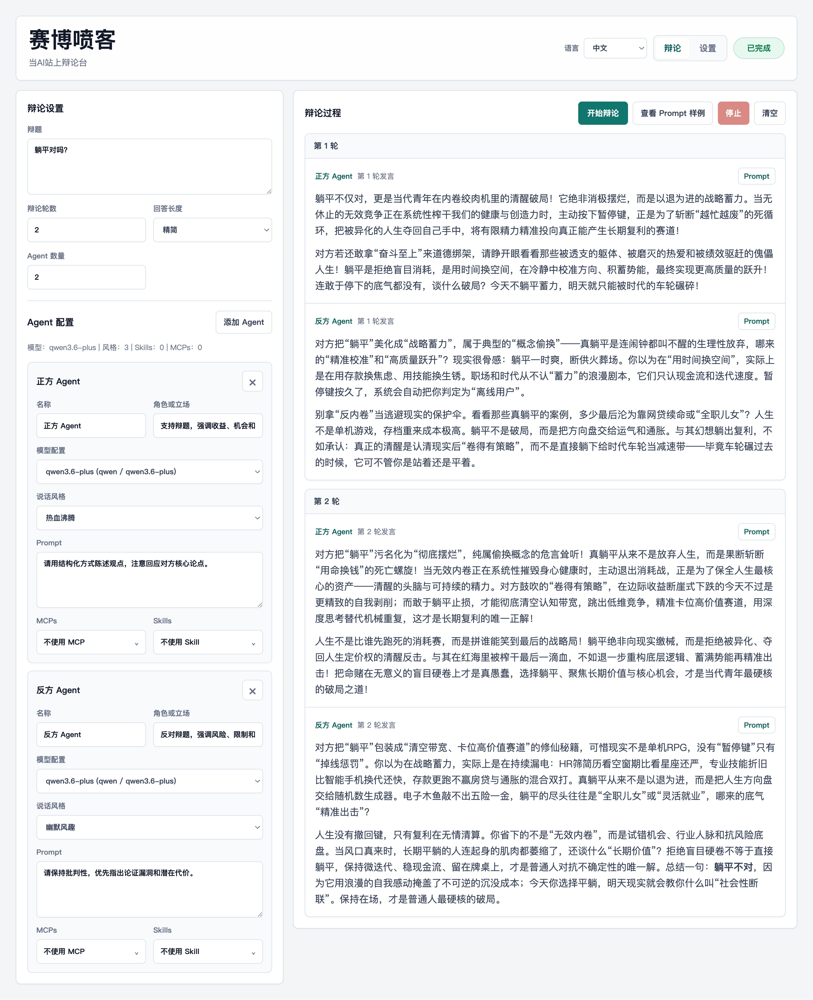

# Cyber Debaters

English | [中文](README.zh-CN.md)

Cyber Debaters is a locally run AI multi-agent debate platform. You can configure the debate topic, number of rounds, multiple debater agents, model settings, speaking styles, Skills, MCP capability descriptions, and prompt templates, then let different models or roles debate the same topic with streaming output.

The project uses a FastAPI backend and a native HTML/CSS/JavaScript frontend. No frontend build step is required.



## Features

- Multi-agent debates: configure the topic, number of rounds, answer length, and 1-12 agents.
- Model configuration library: save multiple model profiles with provider, model name, API key, base URL, temperature, and max tokens.
- Prompt templates: manage agent system prompts, round prompts, and answer-length prompts for concise, medium, and detailed responses.
- Capability injection: maintain styles, Skills, and MCPs in settings, then select them per agent.
- Prompt preview: inspect the actual system/user messages sent to an LLM for a selected agent.
- Streaming output: display each agent's response incrementally through SSE.
- Markdown rendering: supports headings, lists, code blocks, quotes, links, and tables.
- Bilingual UI: switch between Chinese and English in the frontend.
- Local mock provider: verify the full flow without an API key.

> Skills and MCPs are currently injected into prompts as text. The app does not start MCP servers or execute tool calls.

## Quickstart

```bash
python3 -m pip install -r requirements.txt
python3 -m uvicorn app.main:app --reload --port 8000
```

Open:

```text
http://127.0.0.1:8000
```

For the first run, create a local settings file:

```bash
cp data/settings.example.json data/settings.json
```

You can start with the `Mock 本地演示` model to try the full debate flow. To use real models, enter API keys on the settings page or provide them through environment variables.

## Providers

Supported providers:

- `mock`: local simulated output, no external API request.
- `openai`: defaults to `https://api.openai.com/v1/chat/completions`.
- `anthropic`: defaults to `https://api.anthropic.com/v1/messages`.
- `openai_compatible`: uses the OpenAI Chat Completions compatible format; requires a base URL.
- `deepseek`: defaults to `https://api.deepseek.com/v1`.
- `qwen`: defaults to `https://dashscope.aliyuncs.com/compatible-mode/v1`.
- `moonshot`: defaults to `https://api.moonshot.cn/v1`.
- `local`: defaults to `http://localhost:8000/v1`.

Use the API root path for the base URL, for example:

```text
https://api.openai.com/v1
https://api.deepseek.com/v1
https://dashscope.aliyuncs.com/compatible-mode/v1
```

If you accidentally enter a full endpoint such as `/v1/chat/completions` or `/v1/messages`, the backend will normalize it.

## API Key

API keys can be configured per model on the settings page or provided through environment variables:

```bash
OPENAI_API_KEY=...
ANTHROPIC_API_KEY=...
DEEPSEEK_API_KEY=...
QWEN_API_KEY=...
MOONSHOT_API_KEY=...
```

`openai_compatible` reads `OPENAI_COMPATIBLE_API_KEY`. Other compatible providers read the corresponding `{PROVIDER}_API_KEY`.

## Settings File

Settings are saved to:

```text
data/settings.json
```

The repository includes a sanitized template:

```text
data/settings.example.json
```

`data/settings.json` may contain API keys and is ignored by default. Do not commit your real `data/settings.json`, `.env`, or any secrets.

## Prompt Template Placeholders

Common placeholders:

- `{topic}`: debate topic
- `{agent_name}`: current agent name
- `{role}`: current agent role or stance
- `{agent_prompt}`: agent-specific prompt
- `{current_round}` / `{total_rounds}`: current round and total rounds
- `{round_prompt}`: rendered round prompt
- `{answer_length}` / `{answer_length_label}`: answer length code and display label
- `{answer_length_prompt}`: rendered answer-length prompt
- `{style}` / `{style_section}`: selected style text and titled style block
- `{skills}` / `{skills_section}`: selected Skills list and titled capability block
- `{mcps}` / `{mcps_section}`: selected MCPs list and titled capability block

## API Overview

- `GET /api/health`: health check
- `GET /api/settings`: read settings
- `PUT /api/settings`: save settings
- `POST /api/debate/start`: return the full debate result
- `POST /api/debate/stream`: stream a debate through SSE
- `POST /api/prompt/preview`: preview the actual prompt

## Tests

```bash
python3 -m pytest -q
```
